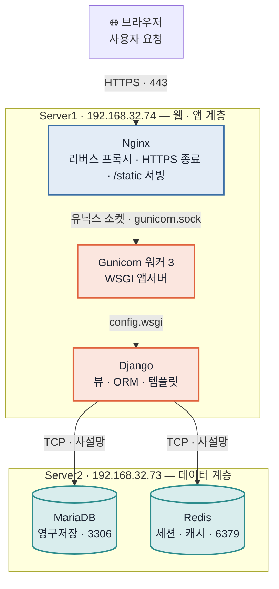

# 밥픽 인프라 · 배포 스터디 노트

> 이 문서는 **발표/설명을 위해 우리 서버 구조를 "왜 이렇게 했는지"까지 이해하는 것**이 목적이다.
> 실제 우리 프로젝트 설정(`config/settings.py`, `deploy/gunicorn.service`, `docs/troubleshooting.md`)에 근거해 작성했다.
> 명령/경로는 우리 환경 기준(Ubuntu 24.04, 사용자 `tester`, 앱 경로 `/home/tester/apps/menu-recommend`).

---

## 0. 3줄 요약 (외워두면 발표 시작이 편함)

1. **웹서버(Nginx) · 앱서버(Gunicorn+Django) · 데이터(MariaDB+Redis)** 3계층으로 분리한 온프레미스 구성이다.
2. 사용자 요청은 **브라우저 → Nginx(HTTPS 종료·정적파일) → Gunicorn(유닉스 소켓) → Django → MariaDB/Redis** 순으로 흐른다.
3. **상태(세션)는 앱이 아니라 Redis에, 설정값은 코드가 아니라 `.env`에** 둬서, 나중에 AWS·컨테이너로 옮겨도 그대로 확장되게 설계했다.

---

## 1. 전체 아키텍처 한 장



- **왜 2대로 나눴나?** 웹/앱과 DB를 물리적으로 분리하면 (1) 각각 독립적으로 재시작·증설 가능, (2) DB 서버는 외부에 포트를 안 열어 보안↑, (3) 나중에 앱 서버만 여러 대로 늘려도(수평 확장) DB는 공유. 이게 **CLAUDE.md 절대원칙 4 "웹서버/앱/DB 계층 분리"** 의 실체다.

---

## 2. 구성요소별 역할 — "이건 왜 있는가"

| 구성요소 | 한 문장 역할 | 없으면? |
|---|---|---|
| **Nginx** | 리버스 프록시. HTTPS 종료, 정적파일 서빙, 요청을 Gunicorn으로 전달 | Django가 정적파일·HTTPS·동시접속을 직접 감당 → 느리고 취약 |
| **Gunicorn** | WSGI 애플리케이션 서버. Django를 여러 워커 프로세스로 실행 | `runserver`(개발용)로는 동시 요청·안정성 부족 |
| **Django** | 우리 웹 애플리케이션(뷰·ORM·템플릿) | — |
| **WSGI** | 웹서버와 파이썬 앱 사이의 표준 규약(`config/wsgi.py`) | Gunicorn이 Django를 어떻게 호출할지 모름 |
| **MariaDB** | 영구 데이터(회원·메뉴·후기·기록) 저장 | 데이터가 안 남음 |
| **Redis** | 세션·캐시 저장(휘발성, 빠름) | 세션을 앱 메모리에 둬야 함 → 확장 불가 |
| **systemd** | Gunicorn·Nginx를 서비스로 관리(부팅 시 자동 실행, 죽으면 재시작) | 터미널 끄면 서버도 꺼짐 |
| **venv** | 프로젝트 전용 파이썬 패키지 격리 | 시스템 파이썬 오염, 버전 충돌 |
| **.env** | 시크릿·환경별 설정값을 코드 밖에 분리 | 비밀번호가 깃에 올라감(사고) |

---

## 3. 요청 한 번의 여정 (발표 핵심 스토리)

브라우저에서 `https://192.168.32.74/menus/` 를 열었을 때:

1. **브라우저 → Nginx(443)**: TLS 핸드셰이크. **여기서 HTTPS가 "종료(termination)"** 된다. 즉 암호화 해제는 Nginx가 하고, 그 뒤(Nginx→Gunicorn)는 평문으로 간다.
2. **Nginx 판단**:
   - `/static/...` 요청이면 → Nginx가 `STATIC_ROOT`(`staticfiles/`) 폴더에서 **직접 파일 응답**(Django까지 안 감. 빠름).
   - 그 외(`/menus/` 등)면 → `proxy_pass` 로 **유닉스 소켓 `/run/gunicorn/gunicorn.sock`** 에 전달.
   - 이때 `proxy_set_header X-Forwarded-Proto $scheme;` 로 **"원래 요청은 https였다"** 는 정보를 헤더로 같이 넘긴다.
3. **Gunicorn**: 소켓으로 받은 요청을 워커 3개 중 하나에 배정 → WSGI 규약으로 Django 호출.
4. **Django**:
   - `SECURE_PROXY_SSL_HEADER` 설정 덕에 `X-Forwarded-Proto: https` 를 보고 "이 요청은 보안 연결"이라고 인식(`request.is_secure()==True`).
   - URL 라우팅 → 뷰 실행 → **ORM으로 MariaDB(Server2) 조회**, **세션은 Redis(Server2) 조회**.
   - 템플릿 렌더링 → HTML 응답 생성.
5. **역방향**: Django → Gunicorn → Nginx → (다시 HTTPS로 암호화) → 브라우저.

> 발표 팁: "**Nginx가 문지기, Gunicorn이 통역사, Django가 일꾼**" 으로 비유하면 이해가 쉽다.

---

## 4. 배포 과정

### 4-1. 처음 서버 세팅(1회) — 큰 흐름
1. Ubuntu에 **시스템 패키지** 설치: `nginx`, `python3-venv`, (DB/Redis는 Server2).
2. 코드 배치: `git clone` → `/home/tester/apps/menu-recommend`.
3. **venv 생성 + 의존성**: `python3 -m venv venv && venv/bin/pip install -r requirements.txt`.
4. **`.env` 작성**(시크릿·DB·Redis 주소 등, 아래 5-4).
5. **DB 준비**: Server2 MariaDB에 DB·계정 생성 → `python manage.py migrate`.
   - ⚠️ **커스텀 User 모델은 첫 migrate 전에 반드시 등록**(절대원칙 6). 나중에 바꾸면 마이그레이션이 꼬인다.
6. **정적파일 수집**: `python manage.py collectstatic` → `staticfiles/` 에 모임(Nginx가 여기서 서빙).
7. **Gunicorn 서비스 등록**: `deploy/gunicorn.service` → `/etc/systemd/system/` 로 복사 → `systemctl enable --now gunicorn`.
8. **Nginx 설정**: 사이트 conf 작성(아래 5-2) → `nginx -t` (문법검사) → `systemctl reload nginx`.
9. **HTTPS**: 인증서 준비(우리는 자체 서명 self-signed) → Nginx 443 블록에 연결, 80→443 리다이렉트.

### 4-2. 코드 업데이트 시(반복) — 우리가 매번 하는 순서
```bash
cd /home/tester/apps/menu-recommend
git pull                                  # 새 코드 받기
venv/bin/pip install -r requirements.txt  # (의존성 바뀐 경우만)
venv/bin/python manage.py migrate         # (모델/마이그레이션 바뀐 경우만)
venv/bin/python manage.py collectstatic --noinput  # (정적파일 바뀐 경우만)
sudo systemctl restart gunicorn           # ★ 앱 코드/템플릿 반영은 재시작 필요
```
> **왜 재시작?** Gunicorn은 부팅 시점의 파이썬 코드/템플릿을 메모리에 올려 실행한다. 파일만 바꾸면 이미 떠 있는 워커엔 반영이 안 된다. **DB 데이터 변경은 즉시 반영**(재시작 무관)이지만 **코드·템플릿·CSS는 재시작(또는 `systemctl reload gunicorn` = HUP)** 이 필요.
> Nginx 설정만 바꿨을 땐 `sudo systemctl reload nginx`.

---

## 5. 핵심 개념 딥다이브 (질문 잘 나오는 것들)

### 5-1. WSGI와 Gunicorn 워커
- **WSGI**: 파이썬 웹앱과 서버 사이의 표준 인터페이스. 우리 진입점은 `config/wsgi.py` 의 `application`. Gunicorn 실행 인자 끝의 `config.wsgi:application` 이 그것.
- **워커 3개**(`--workers 3`): 프로세스 3개가 요청을 나눠 처리 → 동시 접속 대응. 통상 권장치 `2 × CPU코어 + 1`.
- **유닉스 소켓**(`unix:/run/gunicorn/gunicorn.sock`): 같은 서버 안 Nginx↔Gunicorn 통신은 TCP 포트 대신 소켓 파일이 더 빠르고 외부 노출도 없음. `RuntimeDirectory=gunicorn` 이 `/run/gunicorn` 을 만들어 권한(`tester:www-data`, `UMask=007`)을 맞춰줘서 Nginx(www-data)가 소켓을 읽을 수 있다.

### 5-2. 리버스 프록시 & TLS 종료 & X-Forwarded-Proto (★단골 질문)
- TLS(암호화)를 **Nginx에서 풀고** 뒤로는 평문 전달 → Django는 기본적으로 "http로 왔다"고 착각한다.
- 그래서 Nginx가 `X-Forwarded-Proto: https` 헤더로 원 스킴을 알려주고, Django는 `SECURE_PROXY_SSL_HEADER = ('HTTP_X_FORWARDED_PROTO', 'https')` 로 그 헤더를 신뢰한다.
- 이게 없으면: `request.is_secure()`가 False → https인데도 리다이렉트 루프 등 발생(우리 `troubleshooting.md` 7번 사례).
- 대표 Nginx 설정(실제 파일은 서버 `/etc/nginx/sites-available/` 에 있음, 아래는 요지):
```nginx
server {                      # 80 → 443 리다이렉트
    listen 80;
    server_name 192.168.32.74;
    return 301 https://$host$request_uri;
}
server {
    listen 443 ssl;
    server_name 192.168.32.74;
    ssl_certificate     /etc/nginx/ssl/....crt;   # 자체 서명 인증서
    ssl_certificate_key /etc/nginx/ssl/....key;

    location /static/ {                # 정적파일은 Nginx가 직접
        alias /home/tester/apps/menu-recommend/staticfiles/;
    }
    location / {                       # 나머지는 Gunicorn으로
        proxy_pass http://unix:/run/gunicorn/gunicorn.sock;
        proxy_set_header Host $host;
        proxy_set_header X-Forwarded-Proto $scheme;   # ★ 원 스킴 전달
        proxy_set_header X-Real-IP $remote_addr;
    }
}
```
- 짝으로 필요한 Django 설정: `CSRF_TRUSTED_ORIGINS=https://192.168.32.74` (DEBUG=False + https에서 로그인 등 POST의 CSRF 통과에 필요).

### 5-3. 정적파일을 왜 Nginx가 서빙하나
- 이미지·CSS·JS 같은 정적파일은 **Django(파이썬)로 응답하면 느리고 낭비**. Nginx가 파일시스템에서 바로 주는 게 빠르다.
- `collectstatic`은 앱마다 흩어진 정적파일 + `STATICFILES_DIRS`(우리는 프로젝트 공용 `static/`)를 **한 폴더 `STATIC_ROOT`(`staticfiles/`)로 모으는** 작업. Nginx는 그 폴더만 보면 된다.
- 함정(우리가 겪음): 공용 `static/`을 `STATICFILES_DIRS`에 안 넣으면 `collectstatic`이 수집을 못 해 CSS가 반영 안 됨(`troubleshooting.md` 참고). **CSS 바꾸면 반드시 collectstatic**.

### 5-4. 상태를 앱에 두지 않기 — 세션은 Redis (★설계의 핵심)
- `SESSION_ENGINE = 'django.contrib.sessions.backends.cache'` + `CACHES`가 Redis(`REDIS_URL`) → **세션이 앱 프로세스 메모리가 아니라 Redis에 저장**된다.
- **왜 중요?** 앱 서버를 2대, 3대로 늘리면(로드밸런싱) 요청이 아무 서버에나 갈 수 있다. 세션이 특정 서버 메모리에 있으면 다른 서버로 간 순간 로그인이 풀린다. Redis(공용 저장소)에 두면 **어느 앱 서버로 가도 동일한 세션** → **수평 확장 가능**. 이게 절대원칙 1의 이유.
- 추천 결과를 새로고침해도 유지되는 것도 이 세션(Redis)에 핀을 저장하기 때문.

### 5-5. 설정은 환경변수로 — `.env` + django-environ
- `config/settings.py`는 값을 하드코딩하지 않고 `env('SECRET_KEY')` 처럼 **환경변수에서 읽는다**(`environ.Env.read_env('.env')`).
- `.env`(깃에 안 올림)에 들어가는 것들:
```
SECRET_KEY=...
DEBUG=False
ALLOWED_HOSTS=192.168.32.74
CSRF_TRUSTED_ORIGINS=https://192.168.32.74
DB_NAME=...  DB_USER=...  DB_PASSWORD=...  DB_HOST=192.168.32.73  DB_PORT=3306
REDIS_URL=redis://192.168.32.73:6379/0
STATIC_ROOT=/home/tester/apps/menu-recommend/staticfiles
```
- **왜?** (1) 비밀번호를 코드/깃에 안 남김, (2) 개발/운영/AWS에서 **코드는 그대로, 값만 바꿔** 배포(12-factor 원칙). 절대원칙 3.

### 5-6. 업로드 파일은 django-storages (경로 하드코딩 금지)
- 지금 후기 이미지 등은 `ImageField(upload_to=...)`만 쓰고 경로를 코드에 박지 않는다. 운영/2·3단계에서는 **django-storages**로 S3 같은 외부 스토리지에 붙인다.
- **왜?** 앱 서버를 여러 대로 늘리면 각 서버 로컬 디스크에 저장한 파일은 서로 안 보인다. 공용 스토리지(S3)에 둬야 어느 서버에서 올리든 모두 접근 가능. 절대원칙 2.

---

## 6. "지금 이렇게 짠 이유" = 2·3단계 마이그레이션 대비

로드맵: **1단계 온프레미스(현재) → 2단계 AWS 이전 → 3단계 컨테이너 확장**.

| 절대원칙 | 1단계에서의 모습 | 2·3단계에서 빛나는 이유 |
|---|---|---|
| 상태를 앱에 저장 X (세션=Redis) | Redis에 세션 | 앱 서버(EC2/컨테이너) N대로 늘려도 세션 공유 |
| 업로드 경로 하드코딩 X (storages) | ImageField만 | 로컬 디스크 → S3로 코드 변경 없이 전환 |
| 설정값 환경변수 | `.env` | 로컬→AWS 파라미터스토어/시크릿으로 값만 교체 |
| 웹/앱/DB 계층 분리 | 2대 서버 | ALB + Auto Scaling + RDS + ElastiCache로 자연스럽게 매핑 |

→ **발표 한 줄**: "지금은 서버 2대지만, 처음부터 상태·설정·파일을 밖으로 빼놨기 때문에 코드를 거의 안 고치고 AWS·컨테이너로 확장할 수 있게 설계했다."

---

## 7. 자주 쓰는 명령어 · 상태 점검

```bash
# 서비스 상태 / 재시작
sudo systemctl status gunicorn        # 앱 살아있나
sudo systemctl restart gunicorn       # 코드 반영(전체 재시작)
sudo systemctl reload gunicorn        # 무중단 재시작(HUP, 워커 순차 교체)
sudo systemctl reload nginx           # Nginx 설정만 반영
sudo nginx -t                         # Nginx 설정 문법 검사(reload 전 필수)

# 로그 보기 (문제 추적의 출발점)
sudo journalctl -u gunicorn -f        # Gunicorn(=Django 에러) 실시간
sudo tail -f /var/log/nginx/error.log # Nginx 에러

# 앱 점검
venv/bin/python manage.py check       # 설정/모델 정합성
venv/bin/python manage.py migrate     # 마이그레이션 적용
venv/bin/python manage.py collectstatic --noinput

# 소켓/포트 확인
ls -l /run/gunicorn/gunicorn.sock     # 소켓 생겼나
sudo ss -ltnp | grep -E ':(80|443)'   # 웹 포트 누가 잡고 있나
```

> **DEBUG=False에서 500 원인 못 볼 때**: `manage.py shell` + `django.test.Client(raise_request_exception=True)` 로 같은 요청을 재현해 진짜 트레이스백을 뽑는다(우리가 자주 쓴 방법, `troubleshooting.md` 참고).

---

## 8. 발표/질의응답 대비 — 예상 질문 & 모범 답변

- **Q. Nginx랑 Gunicorn 둘 다 왜 필요해요? 하나로 안 되나요?**
  A. 역할이 다르다. Nginx는 HTTPS 종료·정적파일·동시접속 처리에 특화된 웹서버, Gunicorn은 파이썬 앱(Django)을 실행하는 앱서버다. Django의 `runserver`는 개발용이라 운영 트래픽·정적파일·보안을 감당 못 한다. 그래서 앞단(Nginx)+뒷단(Gunicorn)으로 나눈다.

- **Q. HTTPS는 어디서 처리돼요?**
  A. Nginx에서 TLS를 종료한다. Nginx→Gunicorn 구간은 같은 서버 내부 소켓 평문이고, 원 요청이 https였다는 사실은 `X-Forwarded-Proto` 헤더로 Django에 전달한다.

- **Q. 세션(로그인)은 어디에 저장돼요?**
  A. Redis. 앱 프로세스 메모리에 두지 않는 이유는 앱 서버를 여러 대로 늘려도 로그인이 유지되게 하기 위해서다(수평 확장 대비).

- **Q. 서버 2대로 나눈 이유는?**
  A. 웹/앱 계층과 데이터 계층을 분리하면 보안(=DB 포트 외부 비노출)·독립 확장·장애 격리에 유리하다. AWS로 가면 각각 EC2/컨테이너와 RDS/ElastiCache로 매핑된다.

- **Q. 코드 배포하면 어떻게 반영돼요?**
  A. `git pull` 후 필요 시 `migrate`/`collectstatic`, 그리고 `systemctl restart gunicorn`. DB 데이터는 즉시, 코드/템플릿은 재시작해야 반영된다.

- **Q. 비밀번호 같은 건 어떻게 관리해요?**
  A. `.env` 파일에 두고 깃에는 안 올린다. `settings.py`는 값을 하드코딩하지 않고 환경변수에서 읽는다.

- **Q. 정적파일(CSS/이미지)은요?**
  A. `collectstatic`으로 `staticfiles/`에 모으고 Nginx가 `/static/`을 직접 서빙한다. 파이썬을 안 거쳐서 빠르다.

- **Q. 앱이 죽으면요?**
  A. systemd가 `Restart=on-failure`로 자동 재시작하고, 서버 재부팅 시에도 `enable` 되어 자동 기동된다.

---

## 9. 용어 사전 (한 줄 정의)

- **리버스 프록시**: 클라이언트 대신 요청을 받아 뒤의 실제 서버로 넘겨주는 중계자(Nginx).
- **WSGI**: 파이썬 웹앱↔웹서버 표준 규약. Gunicorn이 Django를 부르는 방식.
- **워커(worker)**: 요청을 실제로 처리하는 프로세스. 여러 개면 동시 처리량↑.
- **유닉스 소켓**: 같은 머신 내 프로세스 간 통신용 파일. TCP 포트보다 빠르고 외부 노출 없음.
- **TLS 종료(termination)**: 암호화 연결을 특정 지점(Nginx)에서 풀어 뒤로는 평문 전달.
- **collectstatic**: 흩어진 정적파일을 한 폴더로 모으는 Django 명령.
- **systemd unit/service**: 리눅스에서 프로세스를 서비스로 관리하는 설정(자동 실행·재시작).
- **환경변수 / .env**: 코드 밖에 두는 설정값. 시크릿 분리·환경별 배포에 사용.
- **수평 확장(scale-out)**: 서버 대수를 늘려 처리량을 키우는 방식(↔수직 확장=사양 업).

---

## 10. 더 깊이 볼 것 (공부 순서 추천)

1. Django 공식: *How to deploy with WSGI / Gunicorn*, *Deployment checklist*(`manage.py check --deploy`).
2. Gunicorn 문서: worker 수·타임아웃·소켓.
3. Nginx: `proxy_pass`, `location`, `ssl`, 헤더 전달.
4. systemd: `.service` 유닛 파일 구조(우리 `deploy/gunicorn.service` 뜯어보기).
5. 12-Factor App(설정·상태·백엔드 서비스 분리) — 우리 절대원칙의 이론적 배경.
6. 우리 `docs/troubleshooting.md` — 실제 배포에서 터진 것들(포트 충돌, HTTPS 리다이렉트 루프, 정적파일 미반영, 마이그레이션↔DB 드리프트). **발표 때 "이런 삽질을 이렇게 해결했다"가 가장 인상 깊다.**

---

### 참고 파일(우리 레포)
- `config/settings.py` — 환경변수·DB·Redis·정적·프록시/CSRF 보안 설정
- `deploy/gunicorn.service` — Gunicorn systemd 유닛(워커·소켓·권한)
- `config/wsgi.py` — WSGI 진입점
- `docs/troubleshooting.md` — 실제 장애 해결 기록
- `CLAUDE.md` — 인프라 구성과 4대 절대원칙
